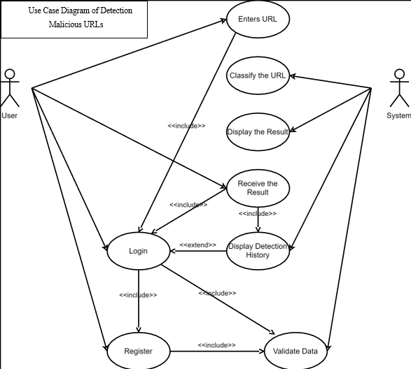
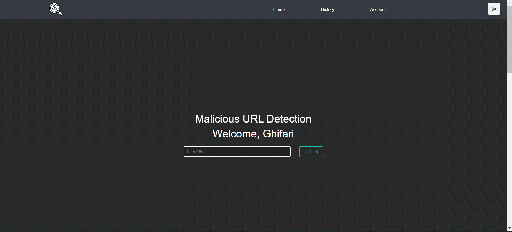
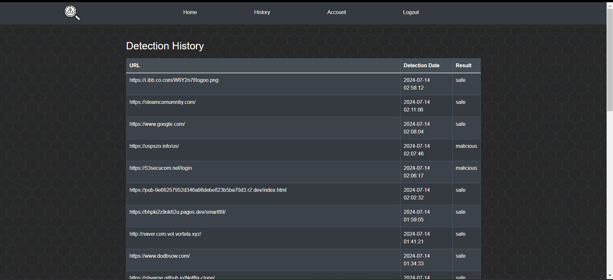

# 🛡️ Malicious URL Detection Using Machine Learning

This project focuses on protecting users from cyber threats—such as **phishing**, **malware**, and **malicious websites**—by using **machine learning** to detect unsafe URLs. By implementing the **Random Forest algorithm**, the system classifies URLs as either *malicious* or *safe*, contributing to a safer web experience for users.

---

## 💡 Project Purpose & Motivation

With the growing number of cyberattacks exploiting deceptive URLs, manual detection methods are no longer sufficient. The goal of this project is to build an **automated and intelligent detection system** that can effectively flag harmful URLs in real-time.

By leveraging the power of machine learning, we aim to:
- Reduce human error in threat identification
- Detect suspicious patterns that are hard to catch manually
- Improve cybersecurity defenses for individuals and organizations

---

## 🧠 How It Works

- **Dataset Preparation**: URLs labeled as malicious or safe are gathered from public datasets.
- **Feature Extraction**: Key features are extracted from the URLs (e.g., length, presence of special characters, domain info, etc.).
- **Model Training**: A **Random Forest Classifier** is trained to detect patterns indicative of malicious behavior.
- **Classification**: Given a new URL, the model predicts whether it's *malicious* or *safe*.

### 🗂️ Use Case Overview

---

## 🔍 Results & Insights

- **High Accuracy**: The Random Forest model performed well in correctly identifying a majority of malicious URLs.
- **Challenges**: 
  - **False Positives**: Some safe URLs are incorrectly flagged as threats.
  - **False Negatives**: Certain malicious URLs may go undetected.
- **Room for Improvement**: While the model offers meaningful protection, reducing these misclassifications through further model tuning, feature engineering, or ensemble techniques remains a priority.

### 📊 Results Sample

---

## 🖥️ User Interface Preview

### Dashboard

### History Tracking

---

## 🔧 Technologies & Tools

- **Language**: Python  
- **Libraries**: `scikit-learn`, `pandas`, `numpy`, `matplotlib`  
- **Algorithm**: Random Forest Classifier  
- **Data Sources**: Public datasets of labeled URLs

---

## 🌟 Project Values

### ✨ Creativity & Expression
While rooted in technical rigor, this project creatively applies machine learning to real-world cybersecurity threats—transforming abstract concepts into a tangible tool for digital safety.

### 🔗 Interdisciplinary Potential
- **Computer Science**: Machine learning, data preprocessing, algorithm optimization.
- **Cybersecurity**: Threat modeling, phishing detection, real-time classification.
- **Ethics & Society**: Advocating for safer online environments through responsible tech.

---

## 🚀 Future Enhancements

- Integrate the model into a browser extension or email scanner
- Add more complex features (e.g., WHOIS data, domain registration info)
- Experiment with deep learning models like LSTM or CNNs for sequential data
